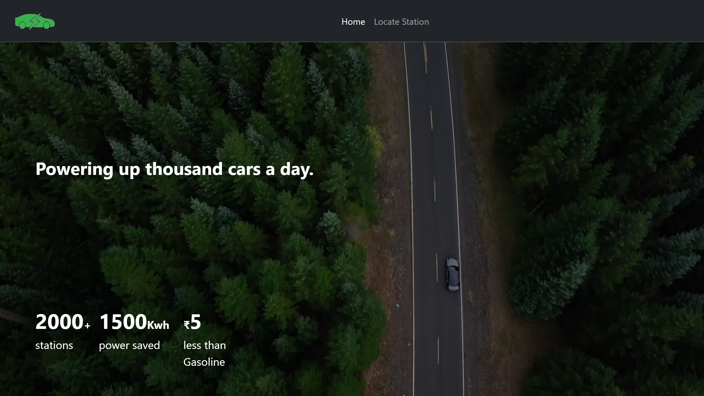

# EV Chargin Station Locator

This project aims to help users to locate EV charging station near them.

### Features
1. EV charging station locator
2. Map based location
3. Pre-booking of station locator
--------------
### Working
* Install Python
* Then clone this repository using this command
    ```bash
    git clone https://github.com/Bhawarth34/EV-Charging-Station-Locator
    ```
 * Setup the project by installing requirements.txt given in the root
    ```bash
    pip install -r requirements.txt
    ```
* After installing all the requirements, now run the following command in the terminal in order to run the server.
    ```bash
    flask run
    ```
* Now the server will start on 127.0.0.1:5000
* Your project is running.
--------
### Future developments
* Online Payment integration
* Live car charging monitoring
* Cross platform application development
-----------------
### Glimpse of project
Homepage


Locator

